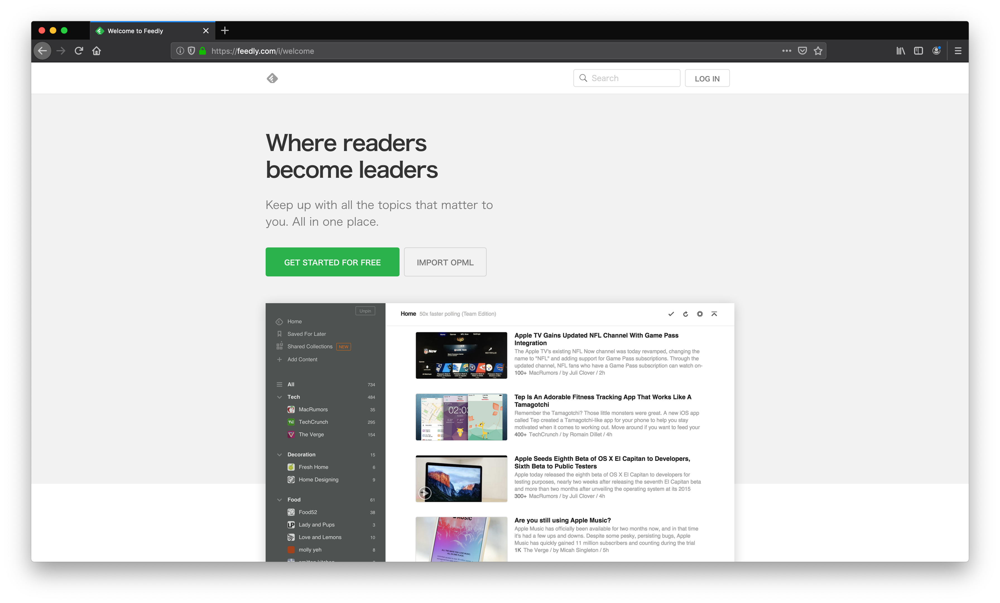
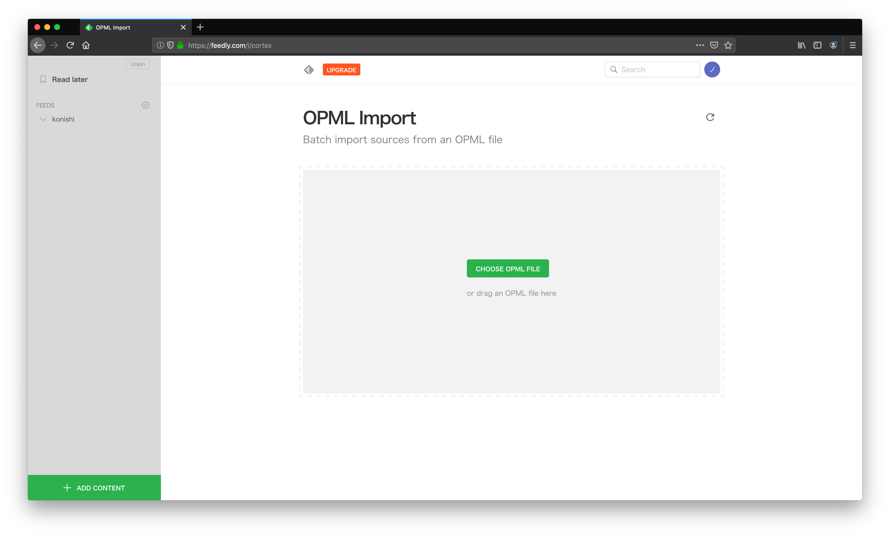

# こにしつよつよエンジニア化計画

## 概要

ハッピーバースデーディアコニシー

誕生日おめでとう。

今回は、情報系ニュースや新技術に疎い小西のために、ある計画を立ち上げた。

その名も...**こにしつよつよエンジニア化計画**

それは、**こにしを新たなステージへと進化させる計画**...

Feedlyの環境をこにしに用意させることで、こにしは**つよつよエンジニア**へと昇華できる...

## Feedlyこそ計画の鍵

**Feedly**とは、いま最も利用されている「RSSリーダー」の1つである。

**Feedly**を利用することで、**さまざまなサイトの情報をまとめてFeedlyで確認・閲覧**することが可能となる...

## Setup

計画発動の鍵となる以下の項目を行う。

- **Feedly**に登録
- **平木場秘伝の見るべきリスト**をインポート
- もっと便利に

### Step 1 - Feedlyに登録

まずは、Feedlyを開く。https://feedly.com/i/welcome

ページが現れたら、`GET STARTED FOR FREE`をクリックするんだ！

なんだァ？これは...

登録方法は色々ある。

- Google
- Feedly
- Facebook
- Twitter
- Microsoft
- Evernote
- メールアドレス

小西がやりやすい方法が良いのだが、小西でもより簡単な**Facebook**認証をおすすめする。

さあ、`Continue with Facebook`をクリックするんだ！

後は簡単。いつもFacebookにログインするが如く、Facebookにログインするんだ！

(おっと？もしかして、パスワードがわからない...？ならばGoogleなど別のログイン方法を選ぶのが良かろう...)

さあ、ログインはできたか？

無事にログインができたら、こんな感じの画面になっているはずだ！

### Step 2 平木場秘伝の見るべきリストをインポート

まずはフォルダを作らなければならない。

ここに写っているボタンを押すんだ！

自分の好きな言葉を入力して`SAVE`してくれ

次は、**FEEDS**タブにある、`歯車`をクリックしよう。

こんな画面になったよね？

真ん中の、`IMPORT OPML`というボタンを押してみよう。

じゃあ、実際にOPMLファイルをインポートしてみよう！

たぶん、このフォルダには`hirakoba_special.xml`が存在しているはずだよね？

そのファイルをドラッグアンドするか、または、下の画像のように、`CHOOSE OPEN FILE`するんだ！

さあ！開こう！

なにか始まったぞ？

終わった....のか？

`Today`を押してみよう...

**WAO!**

俺がいつも見ている光景じゃあないか！？

### Step 3 もっと便利に

#### ブックマーク登録

**まずは、このページをブックマークに登録しよう！**

Feedlyは定期的に見ることが大事なんだ。**毎日見よう**。

#### 見やすくする

次に、自分が好みな表示に変えよう！

このボタンを押すと、見た目を変えることができるぞ！

ちなみに俺のおすすめは**Cards View**だ！

#### スマホアプリをインストールしよう

[Feedly - Smart News Reader](https://apps.apple.com/jp/app/feedly-smart-news-reader/id396069556)

上のリンクを押して、**iOS版Feedly**をダウンロードだ！

iOS版の見た目はこんな感じだぞ！

## おわりに

おつかれさま〜

ここまでちゃんと読んでくれてありがとう☺️。

誕生日プレゼントで俺にしかできないことってないかな〜って探してたら、今回の計画を思いつきました。

こにしには、情報技術に興味・関心をもっと持ってもらって、知識を育んでいってもらえると、とてもうれしいです😇

Feedlyの使い方に関しての詳細は[ココ](https://appli-world.jp/posts/3149)を見てね

改めて、**24歳の誕生日おめでとう！**

~~アラサー待ったなし！~~

こにしとはずっと仲良くなりたいと思っています🥰

ばいびーの〜〜😘

`to be continued...`

~~（来年のプレゼントはどうしようか...）~~

